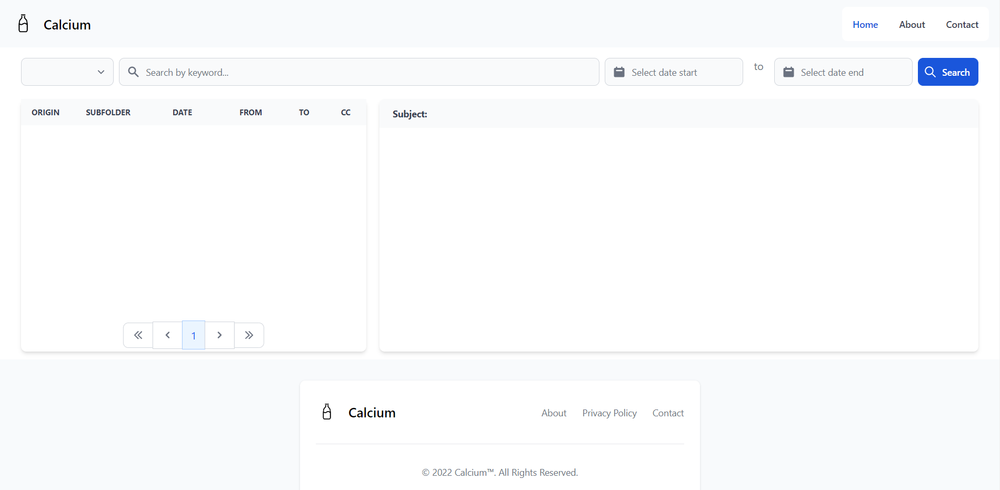
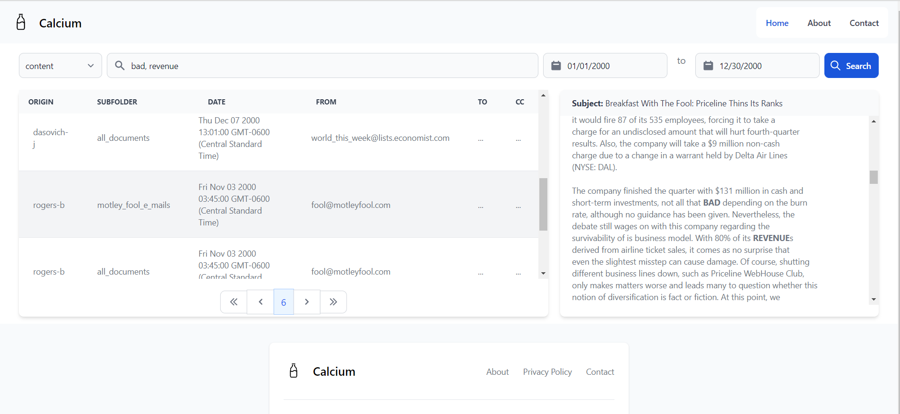

# calcium

calcium is a personal project which consists in a rest-api that makes requests to zinc search engine where is expected to previously index its contents which in this case are email text files.

The indexer is also provided in this project which locates at the path:

`cmd/indexer/indexer.go`

the indexer asks for 2 parameters, the zinc index name, and the path of the text file emails,
for example, run the following command to index the contents of the folder 'resources/mails/samples'
into the zinc index 'emails_test'

`go run cmd/indexer/indexer.go emails_test resources/mails/samples`

And the rest api is located at the path: `cmd/server/server.go`

to run the server just type the following command

`go run cmd/server/server.go`

to run the GUI go to web folder and enter npm run dev

`cd web`

`npm install`

`npm run dev`

## Screenshots

